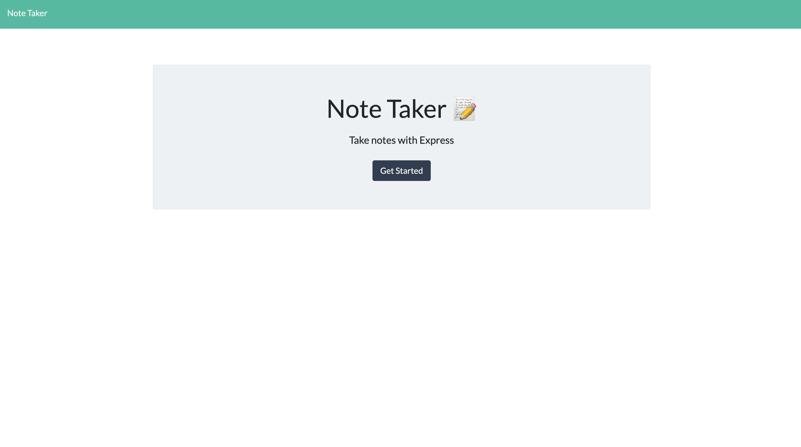
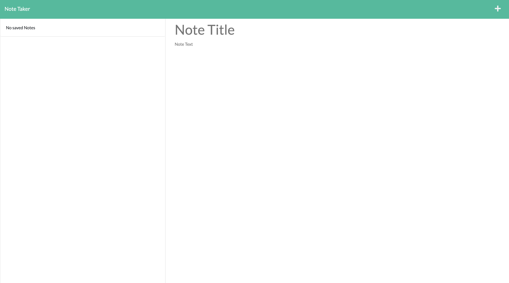

# Note Taker

  

  ## Description

  This application allows users to create notes and save them in order to be able to view them later. This application was built with express.js to connect the front-end and the back-end together.

  ## Table of Contents

  * [Installation](#installation)

  * [Usage](#usage)

  * [License](#license)

  * [Contributing](#contributing)

  * [Tests](#tests)

  * [Questions](#questions)

  ## Installations 

  Use npm i to install all dependencies needed to run the application.

  ## Usage

  To use this application after cloning the repository run npm i to install any necessary depenedencies. If you do not want to run application out of your terminal simply visit the deployed link and check it out!

  
  

  ## License 

  MIT

  ## Contributing Guidelines 

  Please do not contribute to this repo.

  ## Tests

  To run tests please use npm test.

  ## Questions 

  For more information about me checkout my github at https://github.com/marksely. For any questions regarding this repository 

  or how to use this generator please email me at mark.sel9@gmail.com.
  
  ## Deployed Link

  https://note-taker-helper.herokuapp.com/